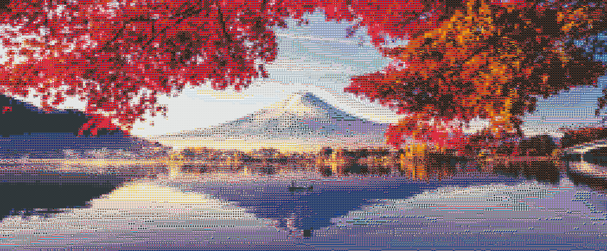

# Mosaic

This currently only operates on mapping individual pixels, I am working on writing this such that it maps multiple pixels to a single palette item, which is a work in progress.

Let's say you have a collection of images, and you want to put them together in a way that resembles any image you'd like.
What this program does, is take as input, a folder of images (out palette), and an input image (what we are trying to recreate).

This basically goes through every item (image) in the palette and finds the average color for each item in the palette.
After this process, we can then go through every pixel in our image, and figure out which item from our palette msot resembles our pixel.
Using this information, we can construct the mosaic by taking the pixels from items in our palette and writing them to a new image.

This can work with any set of images, it doesn't have to be emojis.

## To compile:
`cargo build --release`

## To use:

### For prompts:
- `./mosaic`

### For terminal argument input:
- `./mosaic --help`

## How Do You Use Other Images?
1 **Find a collection of images**
- I recommend the 3500+ emojis available from here: https://twemoji.twitter.com/

2 **Put the images into a named folder**
- In this repo, packaged for convenience, the mentioned collection is named emojis/

3 **Put named folder under palettes/**